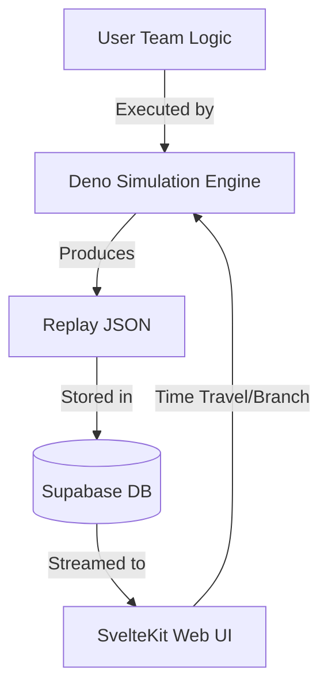

# System Architecture 🏛

This document provides a technical deep dive into the engine and infrastructure
powering Maintainer One.

---

## 🏗 High-Level Architecture

Maintainer One is split into three primary layers:

1. **The Engine (Deno)**: The core simulation logic. It is platform-agnostic and
   focused on raw performance and determinism.
2. **The Platform (Supabase)**: Persistence, Auth, and the "Daily Schedule"
   orchestrator.
3. **The Spectator (SvelteKit)**: The visualization and management interface.



---

## 🎲 The Simulation Engine

### Determinism & Seeded PRNG

To support shared replays and the "Film Room" branching, the simulation must be
100% deterministic.

- **Seeded Randomness**: We use a stateful PRNG (e.g., PCG or Xorshift).
- **PRNG State**: The state of the PRNG itself is stored _inside_ the game
  state. This allows a branch to inherit the exact probability space of the
  parent run.
- **Integer Arithmetic**: All simulation logic uses integer arithmetic
  exclusively. No floating point transcendental functions (Math.sin,
  Math.sqrt, etc.) may feed into game state decisions. Probability thresholds
  are expressed as integer comparisons (e.g., `roll < 37` where roll is 0–99)
  never as floats. This eliminates cross-environment parity bugs permanently.

### State Snapshotting (Redux Pattern)

The engine treats state as an immutable, serializable value.

- Every "Tick" is a pure function: `newState = process(oldState, actions)`.
- **Branching**: Branching is implemented by "rewriting" the actions for a
  future tick but starting from a previously captured state object.

### Cross-Environment Parity

The simulation engine runs in two environments: Deno (server-side official
matches) and the Browser Worker (Film Room client-side playback). Both use V8
but are not always on identical versions.

- **CI Parity Test**: A mandatory CI job runs every official match seed through
  both environments and diffs the full tick logs byte-for-byte. Any divergence
  fails the build immediately.
- **Integer-Only Rule**: The primary guard against parity drift. Pure integer
  arithmetic over a seeded PRNG has no meaningful cross-environment variance.
- **Version Pinning**: The production Deno version is pinned in the deploy
  config so server-side upgrades cannot silently change official match behavior
  mid-season.

---

## 🎛 The Three-Tier Variation Model

Match variation is controlled at three distinct levels. All three must be stored
in the match record to guarantee replay determinism.

| Tier | Scope | Changes on |
| --- | --- | --- |
| **Protocol Version** | Structural rules, what is possible | Scale of years, via RFC process |
| **Config** | Tunable parameters within a protocol (grid size, bot count, zone lifespan, etc.) | Season or special event boundaries |
| **Seed** | Per-match randomness | Every match |

- **Config is a first-class input.** It is locked at simulation time alongside
  code versions and the seed. The Film Room must load the correct config to
  replay a match faithfully.
- **Config enables league diversity.** Private leagues can run dramatically
  different feeling games on the same protocol version purely through config
  divergence, without forking the rules.
- **Config can drift within a season** via narrative event consequences (see
  Lore System). When this occurs the per-match config is stored on the match
  record rather than inheriting the season default.

---

## 🏛 Governance & Instance Structure

Maintainer One is open-source software. The platform and any instance running
on it are deliberately separate concerns.

### Platform vs Instance

- **Platform**: The open-source software itself — engine, UI, simulation
  infrastructure, CLI tools, and protocol packages. The platform maintainer has
  no inherent in-game authority on any instance.
- **Instance**: A deployed running copy of the platform with its own database,
  its own governing body, and its own leagues. Anyone can run one.

On the official instance the platform maintainer and the governing body happen
to be the same person, but they are wearing different hats. This distinction
matters as the project grows.

### Instance Role Hierarchy

Roles within an instance are additive — users can hold multiple roles:

```
Governing Body
├── Owns and evolves one or more named Protocols
├── Sanctions Leagues on specific Protocol versions
├── Runs the Protocol RFC process
└── Manages instance-level event/lore pipeline

League Authority
├── Operates a specific sanctioned League
└── Manages schedule, season config, league-level event pipeline

Team Maintainer
└── Responsible for team logic, identity, and deployment decisions

Contributor
├── Watches, analyzes, proposes logic, submits event ideas
└── Produces artifacts the league remembers

Fan
└── Watches games, roots for teams, votes on lore events, makes predictions
```

### Protocol Ownership

A Protocol is a named, versioned ruleset owned by a governing body. Multiple
protocols can coexist under one governing body, each evolving independently.
Multiple leagues can run on different versions of the same protocol
simultaneously.

Official instance example:

```
Maintainer Authority
├── Maintainer Protocol (V1 → V2 → ...)
│   ├── Maintainer One  (top tier, latest version)
│   └── Maintainer Two  (secondary tier, earlier version)
└── Maintainer AI Protocol (separate versioning cadence)
    └── AI-focused league
```

Private instances define their own governing bodies, protocols, and leagues
without any relationship to the official hierarchy.

---

## 📜 The Protocol System

A **Protocol** defines the rules of the sport. Protocols are versioned to allow
for historical play and evolving mechanics.

- **Storage**: Protocols live in `packages/protocols/v[N]`.
- **Scope**:
  - Defines the Grid (e.g., 10x10).
  - Adjudicates movement and collisions.
  - Calculates scoring events.
  - Defines the schema for the "Sense" data passed to Team Logic.

### Subsystem Versioning

Each protocol version bundles a set of versioned subsystems. The protocol
version governs match mechanics. Other subsystems (draft, recovery, trade,
scouting, lore, etc.) are versioned independently and advance on their own
cadence.

Example:

| Protocol | Match | Draft | Recovery | Trade | Scouting | Lore |
| --- | --- | --- | --- | --- | --- | --- |
| V1 | V1 | — | — | — | — | — |
| V3 | V1 | V1 | — | — | — | — |
| V4 | V2 | V1 | V1 | — | — | — |
| V8 | V2 | V2 | V1 | V1 | V1 | — |
| V10+ | V2 | V2 | V2 | V1 | V1 | V1 |

The match system is intended to remain at V2 for an extended period while all
other subsystems reach at least V1. The lore system is explicitly last — it is
most powerful when all other systems have V1 coverage and the state is rich
enough for consequences to be meaningful.

---

## 🔄 Data Flow

### The Daily Match

1. **Code Lock**: Team logic is locked at a scheduled time before the match.
   No further changes affect the upcoming simulation.
2. **Seed & Event Lock**: The match seed is generated and saved to a secrets
   table. Eligible narrative events are evaluated and locked alongside the seed.
3. **Simulate**: The match is simulated in a single pass on the server,
   producing the full tick log, event queue, and all derived statistics.
4. **Persist**: Results, tick log, event queue, and the complete match snapshot
   (seed + code versions + config + active event state) are written to the
   database.
5. **Release**: A cron job running every ~60 seconds moves the match seed from
   the secrets table to the public match record once the broadcast timestamp
   is reached, adjusting the canonical match start time to account for any
   release delay so viewers do not miss the opening ticks.

### The Film Room (Client-Side)

1. SvelteKit loads the match snapshot: seed, code versions, config, and active
   event state.
2. Playback is handled by a Browser Worker running the same Deno-compatible
   Engine.
3. **Tweak**: When a user tweaks logic, the Worker stops playback and begins a
   "Branch Simulation" from the current tick.
4. **Event Awareness**: The Film Room loads the locked event state so that
   branches reproduce the same narrative consequences as the official match.
   Counterfactual branches (where a consequence did not exist) are also
   supported, allowing viewers to explore what the match would have looked like
   without a triggered event.

### The Broadcast Event Queue

Narrative events that fire mid-match produce a parallel artifact to the tick
log. The broadcast layer consumes this queue independently from tick state
updates, surfacing triggered events with appropriate dramatic weight at the
correct tick during playback. This is distinct from silent state mutations —
triggered events are first-class broadcast moments.

---

## 📦 The Match Snapshot Contract

Every official match must be fully replayable from its snapshot. The snapshot
must include:

- Protocol version
- Protocol config (per-match, not just season default)
- Match seed
- Team code versions (one per team)
- Active event state at simulation time (event id, lifecycle state, any
  accumulated context)

Any input that can affect the simulation result must be in the snapshot.

---

## 🛠 Command Line Tools

### The Local Runner

A Deno-based CLI tool for local development.

- **`match`**: Run a single game between two local files.
- **`benchmark`**: Run 1,000 matches to find win rates (Monte Carlo analysis).
- **`validate`**: Ensure a user script conforms to the current Protocol.

---

_Architecture is the foundation of excellence. Maintain your standards._