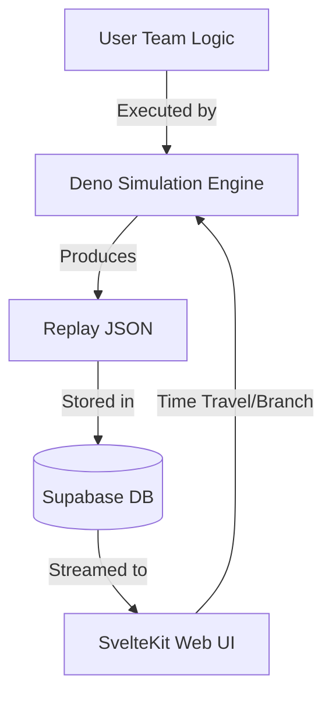

# System Architecture 🏛

This document provides a technical deep dive into the engine and infrastructure
powering Maintainer One.

---

## 🏗 High-Level Architecture

Maintainer One is split into three primary layers:

1. **The Engine (Deno)**: The core simulation logic. It is platform-agnostic and
   focus on raw performance and determinism.
2. **The Platform (Supabase)**: Persistence, Auth, and the "Daily Schedule"
   orchestrator.
3. **The Spectator (SvelteKit)**: The visualization and management interface.

---

## 🎲 The Simulation Engine

### Determinism & Seeded PRNG

To support shared replays and the "Film Room" branching, the simulation must be
100% deterministic.

- **Seeded Randomness**: We use a stateful PRNG (e.g., PCG or Xorshift).
- **PRNG State**: The state of the PRNG itself is stored _inside_ the game
  state. This allows a branch to inherit the exact probability space of the
  parent run.

### State Snapshotting (Redux Pattern)

The engine treats state as an immutable, serializable value.

- Every "Tick" is a pure function: `newState = process(oldState, actions)`.
- **Branching**: Branching is implemented by "rewriting" the actions for a
  future tick but starting from a previously captured state object.

---

## 📜 The Protocol System

A **Protocol** defines the rules of the sport. Protocols are versioned to allow
for historical play and evolving mechanics.

- **Storage**: Protocols live in `packages/protocols/v[N]`.
- **Scope**:
  - Defines the Grid (e.g., 10x10).
  - Adjudicates movement and collisions.
  - Calculates scoring events.
  - Defines the schema for the "Sense" data passed to Team Logic.

---

## 🔄 Data Flow

### The Daily Match

1. **Fetch**: Deno fetches the current "Official Logic" for all teams in a
   league from Supabase.
2. **Simulate**: The match is simulated in a single pass.
3. **Push**: The full replay (or a compressed tick log) is pushed to Supabase.
4. **Release**: SvelteKit reveals the replay to users only after the
   `scheduled_at` timestamp has passed.

### The Film Room (Client-Side)

1. SvelteKit loads the `replay.json`.
2. Playback is handled by a Browser Worker running the same Deno-compatible
   Engine.
3. **Tweak**: When a user tweaks logic, the Worker stops playback and begins a
   "Branch Simulation" from the current tick.

---

## 🛠 Command Line Tools

### The Local Runner

A Deno-based CLI tool for local development.

- **`match`**: Run a single game between two local files.
- **`benchmark`**: Run 1,000 matches to find win rates (Monte Carlo analysis).
- **`validate`**: Ensure a user script conforms to the current Protocol.

---

_Architecture is the foundation of excellence. Maintain your standards._
